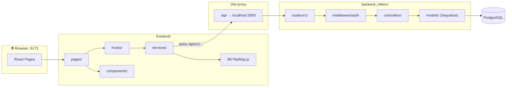
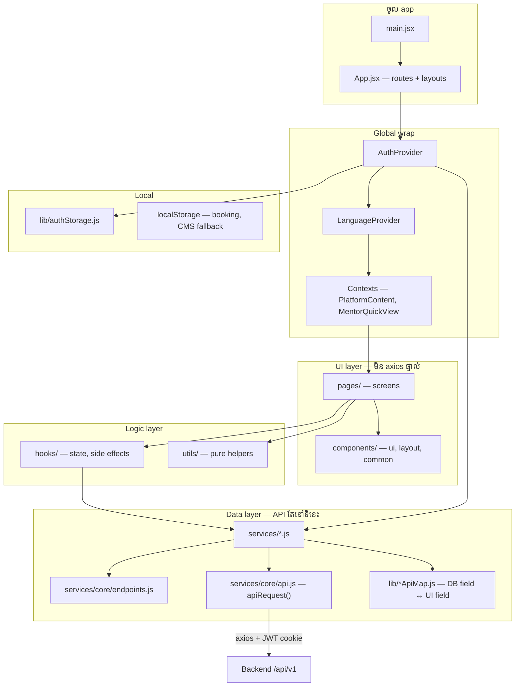
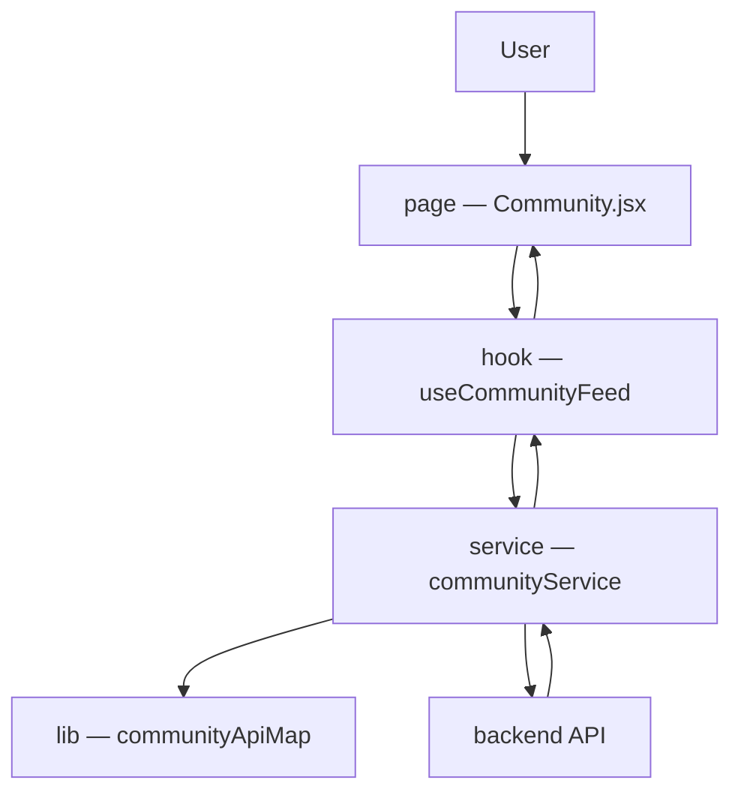
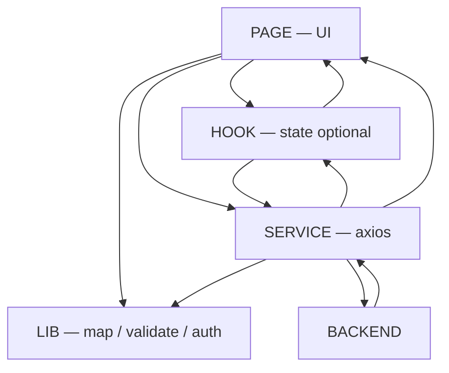
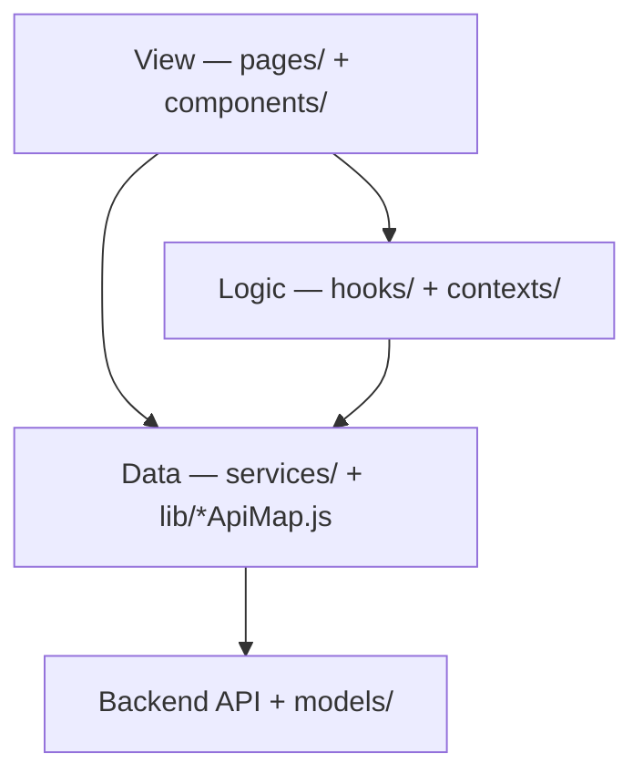
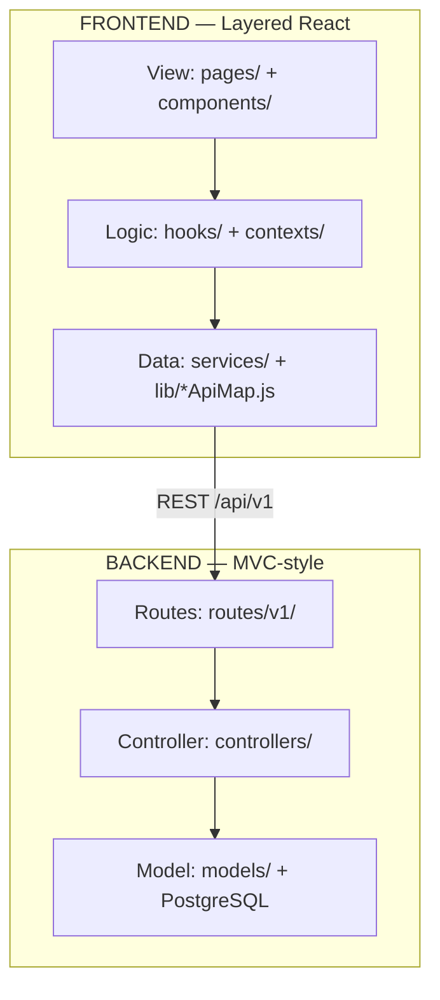
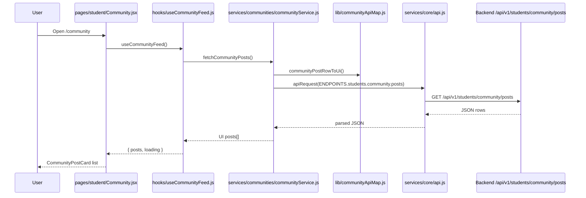
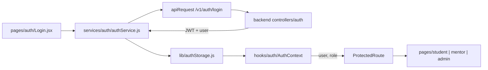
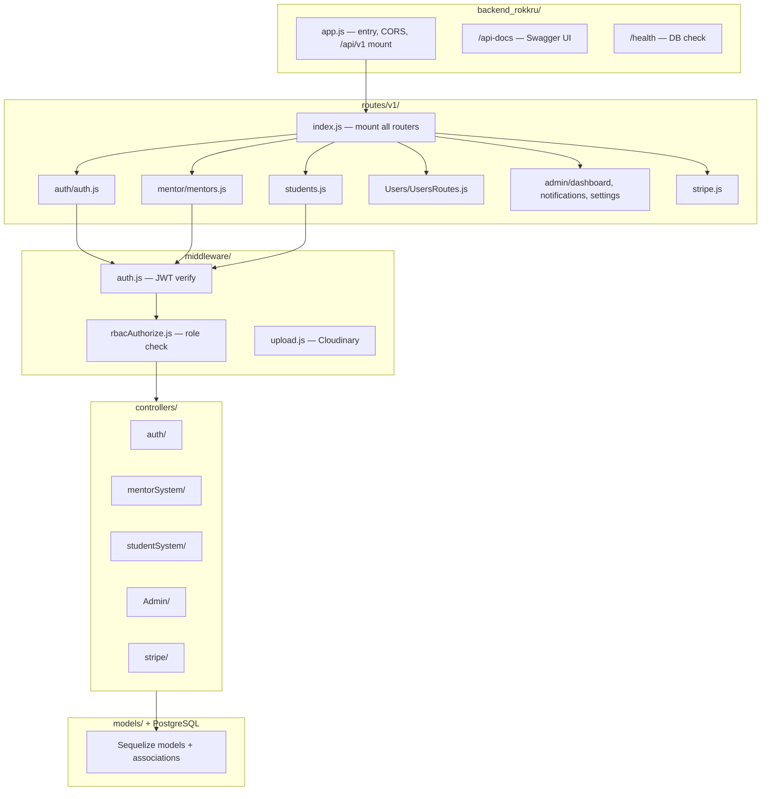
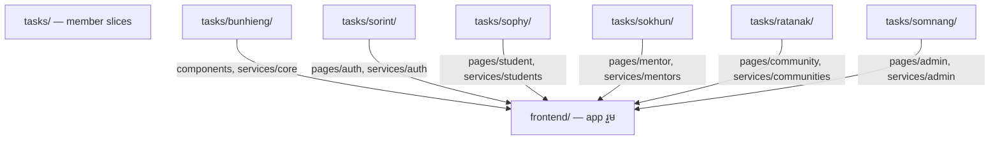

# RokKru — Project Structure & Flow

> **អានរហ័ស:** `frontend/` = app រួម · `tasks/` = task របស់ member · `backend_rokkru/` = API + DB  
> **Workflow:** [`GIT_WORKFLOW.md`](GIT_WORKFLOW.md) · **Tasks:** [`frontend/docs/TEAM_TASKS.md`](frontend/docs/TEAM_TASKS.md)

**មាតិកា**

| § | រូបភាព |
|---|--------|
| [1](#1-workspace--folder-នីមួយធ្វើអី) | Workspace folders |
| [2](#2-big-picture--ពី-browser-ទៅ-database) | Browser → DB |
| [3.0](#30-តួនាទីនីមួយៗ--frontend-src) | **តួនាទីរួម Frontend** |
| [3.2.1](#321-page--hook--service--lib--តួនាទី--flow) | Page → Hook → Service → Lib |
| [4.0](#40-តួនាទីនីមួយៗ--backend) | **តួនាទី Backend** |
| [6](#6-team--folder-ownership-tasks) | Team ownership |

---

## 1. Workspace — folder នីមួយធ្វើអី?

```
d:\Full Frontend/
├── frontend/          ← App React ពេញ (run npm run dev)
├── tasks/             ← Slice តាម member (commit GitLab)
├── backend_rokkru/    ← API Express + PostgreSQL
├── scripts/           ← extract-tasks.ps1, paste-task.ps1
├── GIT_WORKFLOW.md
└── PROJECT_STRUCTURE.md   ← file នេះ
```

| Folder | ប្រើធ្វើអី? | នរណា? |
|--------|------------|--------|
| **`frontend/`** | App រួម — routes, pages, components, services | គ្រប់គ្នា pull មុន |
| **`tasks/<member>/`** | Copy task របស់អ្នក (mirror `frontend/src/`) | Commit តែ folder របស់ខ្លួន |
| **`backend_rokkru/`** | REST API, auth, DB models | Backend team |
| **`scripts/`** | `paste-task.ps1` (tasks → frontend), `extract-tasks.ps1` (frontend → tasks) | Lead / Bunhieng |

---

## 2. Big picture — ពី Browser ទៅ Database



**URL chain (ឧទាហរណ៍):**

```
Browser  →  GET /api/v1/students/community/posts
Vite     →  proxy  →  http://localhost:3000/api/v1/students/community/posts
Express  →  routes/v1/students.js  →  controller  →  PostgreSQL
```

---

## 3. Frontend — រចនាសម្ព័ន្ធ & flow

### 3.0 តួនាទីនីមួយៗ — Frontend `src/`

> **ចងចាំមួយបន្ទាត់:** User ចូល **page** → (optional **hook**) → **service** (axios) → **lib** (map) → **backend**

#### រូបភាពតួនាទី

```text
┌─────────────────────────────────────────────────────────────┐
│  ENTRY          main.jsx → App.jsx (routes)                 │
├─────────────────────────────────────────────────────────────┤
│  VIEW           pages/ + components/     ← user ឃើញ          │
├─────────────────────────────────────────────────────────────┤
│  LOGIC          hooks/ + contexts/       ← state, effects     │
├─────────────────────────────────────────────────────────────┤
│  API            services/                ← axios only       │
│                   └→ lib/ (map, validate)  ← service ហៅ    │
├─────────────────────────────────────────────────────────────┤
│  CONFIG         constants/ · utils/      ← env, helpers     │
└─────────────────────────────────────────────────────────────┘
```

#### តារាងតួនាទី — រួម

| Folder | តួនាទី (ធ្វើអី?) | មិនធ្វើអី? | ហៅពី | Owner |
|--------|------------------|-----------|-------|-------|
| **`App.jsx`** | URL → page, layout, `ProtectedRoute` | business logic, API | Browser | Bunhieng |
| **`pages/`** | Screen ពេញ (student home, login…) | axios, map API fields | `App.jsx` | តាម role |
| **`components/`** | UI ដំណើរការឡើងវិញ (button, card, layout) | API calls | `pages/`, components | Bunhieng |
| **`hooks/`** | `useState`, load data, form logic | render UI, axios ផ្ទាល់ | `pages/` | តាម role |
| **`contexts/`** | Global state (auth-adjacent, CMS) | HTTP | `App.jsx`, pages | តាម feature |
| **`services/`** | **axios** → `/api/v1` | UI, rename DB fields | hooks, pages, AuthContext | តាម domain |
| **`lib/`** | Map UI↔API, validate, auth, i18n | HTTP | **services/** (ឬ pages) | តាម mapper |
| **`constants/`** | env, route names, defaults | API calls | services, pages | Bunhieng |
| **`utils/`** | Pure helpers (filter, export, phone) | HTTP, React state | pages, hooks, lib | តាម feature |

---

#### `App.jsx` + `main.jsx` — ចូល app & routes

| | |
|---|---|
| **តួ** | Bootstrap React · កំណត់ URL → component |
| **ធ្វើ** | `BrowserRouter`, wrap `AuthProvider`, define `/student/*`, `/mentor/*` |
| **មិនធ្វើ** | load API data, form validation |
| **ឧទាហរណ៍** | `App.jsx`, `main.jsx` |

---

#### `pages/` — Screen (អ្វី user ឃើញ)

| | |
|---|---|
| **តួ** | **View** — រូបភាពពេញមួយទំព័រ |
| **ធ្វើ** | Compose `components/`, call `hooks/`, handle click/submit |
| **មិនធ្វើ** | `axios` / `apiRequest` ផ្ទាល់ · map `firstname`→`firstName` |
| **ហៅ** | `hooks/`, `services/` (ខ្លះ page), `lib/` (display profile) |
| **ឧទាហរណ៍** | `pages/student/Community.jsx`, `pages/auth/Login.jsx` |
| **Owner** | Sorint (auth), Sophy (student), Sokhun (mentor), Ratanak (community), Somnang (admin) |

---

#### `components/` — UI blocks

| Subfolder | តួ | ឧទាហរណ៍ |
|-----------|-----|----------|
| **`ui/`** | Primitives — button, input, modal | `Button.jsx`, `Avatar.jsx` |
| **`layout/`** | Shell — navbar, sidebar, guard | `MainLayout`, `ProtectedRoute` |
| **`common/`** | Feature blocks ប្រើរួម | `MentorCard`, `CreatePostModal` |
| **`backgrounds/`** | Page ambient / mesh | `PageAmbient` |
| **`mentor/`** | Mentor-only widgets | `MentorPostedSessionsPanel` |

| | |
|---|---|
| **មិនធ្វើ** | API calls · heavy business rules |
| **Owner** | Bunhieng (shared) · feature owner សម្រាប់ role widgets |

---

#### `hooks/` — Logic & state

| | |
|---|---|
| **តួ** | **Logic layer** — data loading, form state, side effects |
| **ធ្វើ** | `useState`, `useEffect`, return `{ data, loading, error }` |
| **មិនធ្វើ** | Render JSX (តែងតែទុកឲ្យ page) · map API fields |
| **ហៅ** | `services/` |
| **ឧទាហរណ៍** | `useCommunityFeed.js`, `useMentorDashboard.js`, `AuthContext` |
| **ចំណាំ** | **មិនមានគ្រប់ page** — page តូចអាច `useState` ផ្ទាល់ |

---

#### `services/` — API layer (axios)

| | |
|---|---|
| **តួ** | **ទូរទៅ backend** — តែ HTTP |
| **ធ្វើ** | `apiRequest(ENDPOINTS...)`, return JSON / UI-ready data |
| **មិនធ្វើ** | Render UI · duplicate field mapping (ប្រើ `lib/*ApiMap`) |
| **ហៅ** | `services/core/api.js`, `endpoints.js`, `lib/*ApiMap.js` |
| **ឧទាហរណ៍** | `communityService.js`, `authService.js`, `mentorService.js` |

**`services/core/`** (Bunhieng)

| File | តួ |
|------|-----|
| `api.js` | `apiRequest()` — **axios** + JWT + cookies |
| `endpoints.js` | Path constants — **must match backend** |
| `apiErrors.js` | `ApiError` class |

---

#### `lib/` — Map · Validate · Session · i18n

| | |
|---|---|
| **តួ** | **ជំនួយ service & page** — មិនមែន HTTP |
| **ចំណាំសំខាន់** | **`lib` មិនដើរមុន `service`** — **service ហៅ lib** |

| Subfolder / file | តួ | ឧទាហរណ៍ |
|------------------|-----|----------|
| **`*ApiMap.js`** | Backend field ↔ UI field | `firstName` ↔ `firstname` |
| **`validation/`** | Form rules មុន submit | phone, password, profile complete |
| **`authStorage.js`** | Token, user, cookie `token=` | login session |
| **`studentProfile.js`** | Build profile object for UI | `resolveStudentProfile(user)` |
| **`localeEn.js` / `localeKm.js`** | Translation strings | `t('auth.login')` |
| **`LanguageProvider.jsx`** | i18n context | wrap app |

| Owner | Files |
|-------|-------|
| Sophy | `studentApiMap.js`, `validation/student/` |
| Sokhun | `mentorApiMap.js`, `validation/mentor/` |
| Ratanak | `communityApiMap.js` |
| Bunhieng | `authStorage.js`, i18n, shared validation |

---

#### `constants/` · `utils/` · `contexts/`

| Folder | តួ | ឧទាហរណ៍ |
|--------|-----|----------|
| **`constants/`** | Static config — env, routes, filter labels | `env.js`, `studentRoutes.js` |
| **`utils/`** | Pure functions — no React, no HTTP | `filterMentors.js`, `phoneInput.js` |
| **`contexts/`** | React context spanning many pages | `PlatformContentContext` |

**`lib/` vs `utils/`:** `lib/` = domain (student, mentor, auth) · `utils/` = generic helpers (often call `lib/validation`)

---

#### ច្បាប់មាស (សង្ខេប)

| # | ច្បាប់ |
|---|--------|
| 1 | **page** ចាប់ផ្តើម — user បើក screen |
| 2 | **axios** តែក្នុង `services/` |
| 3 | **map API field** តែក្នុង `lib/*ApiMap.js` |
| 4 | **service → lib** (មិនមែន lib → service) |
| 5 | **components** គ្មាន API |

### 3.1 Layer diagram — ហៅពីណាទៅណា



### 3.2 ច្បាប់មាស (frontend)

> ពេញ: [§3.0 តួនាទីនីមួយៗ](#30-តួនាទីនីមួយៗ--frontend-src)

| Layer | Folder | ធ្វើអី? | ហៅពីណា? | ទៅណា? |
|-------|--------|---------|---------|-------|
| **Route** | `App.jsx` | URL → page component | Browser URL | `pages/*`, `ProtectedRoute` |
| **Page** | `pages/` | Screen UI, compose components | `App.jsx` routes | `hooks/`, `components/` |
| **Hook** | `hooks/` | Load data, form state | `pages/` | `services/` |
| **Service** | `services/` | HTTP calls only | `hooks/`, `AuthContext` | `apiRequest()` → backend |
| **Mapper** | `lib/*ApiMap.js` | Rename backend fields for UI | `services/` (called inside) | — |
| **Lib (other)** | `lib/` | validate, authStorage, i18n, profile | `services/`, `pages/` | — |
| **Component** | `components/` | Reusable UI blocks | `pages/`, other components | — |
| **Core** | `services/core/` | `endpoints.js`, `api.js` | All services | Backend |

> **ហាម:** `pages/` មិន `axios` ផ្ទាល់ — តែងតែហៅ `services/` (`apiRequest`)

### 3.2.1 Page → Hook → Service → Lib — តួនាទី & flow

**ចាប់ផ្តើមពី user = `page`** (មិនមែន `lib`)។  
**`lib` មិនដើរមុន `service`** — **`service` ហៅ `lib`** នៅពេលត្រូវ map / validate data។

#### 4 តួ — ធ្វើអី?

| តួ | Folder | ធ្វើអី? |
|----|--------|---------|
| **Page** | `pages/` | UI ដែល user ឃើញ |
| **Hook** | `hooks/` | state + load data (`loading`, `posts[]`) — **មិនមានគ្រប់ page** |
| **Service** | `services/` | axios → API (`apiRequest`) |
| **Lib** | `lib/` | បក field UI ↔ API, validate form, auth session, i18n |

#### Service vs Lib

| | `services/` | `lib/` |
|---|-------------|--------|
| **តួ** | ទូរទៅ backend | ឧបករណ៍ជំនួយ (mapper, validate) |
| **ចាប់ផ្តើម** | page/hook ហៅ service | **service ហៅ lib** (ឬ page ហៅ lib ផ្ទាល់) |
| **HTTP** | ✅ axios | ❌ គ្មាន |

**Service ហៅ lib 2 ពេល:**

1. **មុនផ្ញើ API** — `studentProfileToApiPayload()` (UI → backend body)
2. **បន្ទាប់ទទួល API** — `communityPostRowToUi()` (backend row → UI object)

#### Flow ធម្មតា (មាន Hook) — Community



```
User → page → hook → service → lib (map) → axios → API
                                              ↓
                                    data ត្រឡប់ → hook → page render
```

#### Flow មួយទៀត (គ្មាន Hook ផ្ទាល់) — Edit Profile

```
page/StudentEditProfile.jsx
  ├→ lib/studentProfile.js           ← បង្ហាញ form (មិនទាន់ API)
  └→ service/studentProfileService   ← save / load API
         └→ lib/studentApiMap.js     ← map ក្នុង service
         └→ axios PUT /v1/students/me
```

#### រូបភាពរួម



#### គោលបំណង `lib/` — ហេតុផលប្រើ

| មូលហេតុ | ឧទាហរណ៍ |
|---------|----------|
| Backend field ≠ UI field | `firstName` ↔ `firstname` |
| Service ស្អាត | HTTP តែក្នុង `services/` |
| Validation កន្លែងតែមួយ | `lib/validation/` |
| Auth session | `lib/authStorage.js` |
| Team ownership | `studentApiMap` (Sophy), `mentorApiMap` (Sokhun) |

#### កុំច្រលំ

| ❌ មិនត្រឹម | ✅ ត្រឹម |
|-----------|--------|
| `lib` ដើរមុន `page` | **page** ចាប់ផ្តើម (user បើក screen) |
| `lib → service` (រហូត) | **`service → lib`** (service ហៅ lib) |
| `lib` = `service` | service = HTTP · lib = map/validate |

### 3.2.2 MVC ឬអត់? — Frontend vs Backend pattern

**ចម្លើយខ្លី:** Frontend **មិន** follow MVC បែបចាស់ — ប្រើ **Layered React** (View + Hooks + Services)។  
**Model** ពិតស្ថិតនៅ **backend** (`models/` + PostgreSQL) តែមួយ។

#### MVC បែបចាស់ vs RokKru

| MVC (classic) | RokKru frontend | Folder |
|---------------|-----------------|--------|
| **Model** — data + business rules | ❌ មិនមាន model នៅ frontend | Backend `models/` (Sequelize) |
| **View** — UI only | ✅ Pages + Components | `pages/`, `components/` |
| **Controller** — handle input, update model | ⚠️ មិនមាន folder `controllers/` | `hooks/`, `contexts/` ធ្វើតួជំនួស |
| API / data access | ✅ Services | `services/` |

#### Frontend pattern (Layered React)



| Layer | Folder | តួនាទី (≈ MVC) |
|-------|--------|----------------|
| **View** | `pages/`, `components/` | បង្ហាញ UI — មិនដាក់ business logic ធ្ងន់ |
| **Logic** | `hooks/`, `contexts/` | ≈ Controller — state, side effects, orchestration |
| **Data** | `services/`, `lib/*ApiMap.js` | ≈ Model access — HTTP + map API fields |
| **Route** | `App.jsx` | URL → page (React Router, មិនមែន MVC controller) |

#### Backend vs Frontend — ប្រៀបធៀប

| | Backend (`backend_rokkru/`) | Frontend (`frontend/src/`) |
|---|------------------------------|----------------------------|
| **Pattern** | **MVC-style** ✅ | **Layered / Feature-based** |
| **Model** | `models/` — Sequelize + PostgreSQL | — (data មកពី API) |
| **Controller** | `controllers/` | `hooks/` + `contexts/` |
| **View** | — (JSON response) | `pages/` + `components/` |
| **Routes** | `routes/v1/` | `App.jsx` |

#### ហេតុផល Frontend មិនប្រើ full MVC

**1. MVC បែបចាស់ = server-rendered apps**

```
User request → Controller → Model (DB) → Controller → View (HTML)
```

ល្អពេល server បង្កើត HTML ហើយផ្ញើទៅ browser (PHP, Rails, Laravel…)។  
RokKru frontend = **SPA** — React load ម្តង, UI update ក្នុង browser, data មកជា **JSON** ពី API។

**2. Model មានតែមួយ — នៅ backend**

```
PostgreSQL + Sequelize  →  backend/models/
                              ↓ JSON (/api/v1)
                         frontend/services/   (ទទួល + map data តែប៉ុណ្ណោះ)
```

បើដាក់ `models/` នៅ frontend ផង → duplicate business rules, sync លំបាក, team conflict។

**3. React មិនធ្វើបែប MVC class-based**

React រួម **View + Logic** ក្នុង component/hook — មិនមាន `Controller` class ដាច់ដូច MVC។  
Pattern ធម្មតា៖ **Components** + **Hooks** + **Service layer** (standard សម្រាប់ React + REST API)។

**4. បង្ខំ MVC 3 folder ធ្វើឲ្យ team confusing**

```
views/StudentProfile.jsx
controllers/StudentController.js   ← hook ឬ class?
models/Student.js                  ← copy DB schema? localStorage?
```

RokKru workflow `pages → hooks → services` **ច្បាស់ជាង** — ត្រូវនឹង folder ownership (`tasks/sophy/`, …)។

#### Architecture split — MVC ពេញនៅ backend



#### Example — Login (layered, not MVC)

| Step | Path | Layer |
|------|------|-------|
| 1 | `pages/auth/Login.jsx` | View |
| 2 | `services/auth/authService.js` | Data (API call) |
| 3 | `hooks/auth/AuthContext.jsx` | Logic (session state) |
| 4 | `backend/controllers/auth/` | MVC controller (server) |
| 5 | `backend/models/userModel.js` | MVC model (server) |

#### សង្ខេប

| សំណួរ | ចម្លើយ |
|--------|--------|
| Frontend use full MVC? | **ទេ** — Layered React |
| Backend use MVC? | **បាទ** — routes → controllers → models |
| Model នៅណា? | **Backend** តែមួយ |
| Controller នៅ frontend? | **`hooks/` + `contexts/`** (≈ controller) |
| View នៅ frontend? | **`pages/` + `components/`** |

#### Example — Community (layered flow)

```
User opens /community
  → pages/student/Community.jsx       (View)
  → hooks/useCommunityFeed.js         (Logic)
  → services/communities/communityService.js  (Data)
  → lib/communityApiMap.js            (transform API ↔ UI)
  → GET /api/v1/students/community/posts
  → backend controller + model        (MVC នៅ server)
```

### 3.3 Folder tree — `frontend/src/`

```
src/
├── App.jsx              # រៀប routes ទាំងអស់
├── main.jsx             # React entry
├── i18n.js              # EN / KM
│
├── pages/               # 📱 Screens (1 folder = 1 role/module)
│   ├── auth/            # Login, Register, Forgot password
│   ├── onboarding/      # Complete profile, choose community
│   ├── student/         # Home, Schedule, Community, Profile, BookSession…
│   ├── mentor/          # Dashboard, Schedule posts, Billing, Analytics…
│   ├── admin/           # Dashboard, Users, Reports, Settings…
│   ├── community/       # Create community, post detail
│   └── legal/           # Help, Terms, Privacy
│
├── components/
│   ├── ui/              # Button, Input, Modal… (shadcn-style)
│   ├── layout/          # MainLayout, AdminLayout, ProtectedRoute, Navbar
│   ├── common/          # MentorCard, PageCard, CreatePostModal…
│   ├── backgrounds/     # Page ambient backgrounds
│   └── mentor/          # Mentor-only widgets
│
├── hooks/
│   ├── auth/            # AuthContext, useAuth
│   ├── mentor/          # useMentors, useMentorDashboard…
│   ├── admin/           # useAdminUsers, useDashboardStats…
│   ├── forms/           # useBookingForm, useReviewForm…
│   └── ui/              # useModal, usePagination…
│
├── services/            # 🌐 API layer
│   ├── core/            # api.js, endpoints.js, apiErrors.js
│   ├── auth/
│   ├── mentors/
│   ├── students/
│   ├── communities/
│   ├── admin/
│   ├── platform/        # search, filters, stripe, notifications
│   └── sessions/        # wraps mentor posts as schedule slots
│
├── lib/                 # Map API↔UI, validation, authStorage, i18n
│   ├── *ApiMap.js       # studentApiMap, mentorApiMap, communityApiMap
│   ├── authStorage.js   # token, cookie, session
│   ├── validation/      # student, mentor, shared rules
│   └── localeEn.js / localeKm.js
├── constants/           # env.js, routes, filter defaults
├── utils/               # Pure helpers
├── contexts/            # PlatformContent, MentorQuickView
└── assets/
```

### 3.4 Example flow — Community page (Ratanak)



### 3.5 Auth flow



| Role | UI folder | URL prefix |
|------|-----------|------------|
| Guest | `pages/auth`, `pages/legal` | `/`, `/login`, `/register` |
| Student | `pages/student` | `/student/*`, `/community` |
| Mentor | `pages/mentor` | `/mentor/*` |
| Admin | `pages/admin` | `/admin/*` |

---

## 4. Backend — រចនាសម្ព័ន្ធ & flow

### 4.0 តួនាទីនីមួយៗ — Backend

> **Pattern:** **MVC-style** — `routes` → `middleware` → `controllers` → `models` → PostgreSQL

#### រូបភាពតួនាទី

```text
HTTP /api/v1/...
    ↓
app.js          ← entry, CORS, cookies
    ↓
routes/v1/      ← URL path → router
    ↓
middleware/     ← JWT verify, role check (student|mentor|admin)
    ↓
controllers/    ← business logic, validate input
    ↓
models/         ← Sequelize → PostgreSQL
    ↓
JSON response
```

#### តារាងតួនាទី — រួម

| Folder / file | តួនាទី | ធ្វើអី? | មិនធ្វើអី? |
|---------------|--------|---------|-----------|
| **`app.js`** | Server entry | Mount `/api/v1`, CORS, DB sync, `/health` | Business per feature |
| **`routes/v1/`** | **Router** | Map URL → controller function | SQL queries |
| **`middleware/auth/`** | **Guard** | Verify JWT, check role (`authorize`) | Business rules |
| **`controllers/`** | **Controller** | Request → logic → call model → JSON | Define URL paths |
| **`models/`** | **Model** | Sequelize schema, associations, queries | HTTP response format |
| **`config/`** | Setup | DB connection, Swagger | — |
| **`utils/`** | Helpers | Email, Stripe, mentor query helpers | Route definitions |

#### `routes/v1/` — URL mapping

| Router file | Base path | អ្វីដែល handle |
|-------------|-----------|----------------|
| `auth/auth.js` | `/v1/auth/*` | login, register, OTP, password |
| `mentor/mentors.js` | `/v1/mentors/*` | list, posts, portfolio, skills, ratings |
| `students.js` | `/v1/students/*` | profile, **community** posts |
| `Users/UsersRoutes.js` | `/v1/users/me` | shared profile + avatar |
| `admin/*` | `/v1/admin/*` | dashboard, notifications, settings |
| `stripe.js` | `/v1/stripe/*` | checkout, webhook |

#### `controllers/` — business logic

| Folder | តួ | ឧទាហរណ៍ |
|--------|-----|----------|
| `auth/` | Login flow, OTP, tokens | `authControllers.js` |
| `mentorSystem/` | Mentor CRUD, posts, analytics | `mentorPostsController.js` |
| `studentSystem/` | Student profile, community | `studentCommunityController.js` |
| `Admin/` | Dashboard stats, user mgmt | `dashBoardController.js` |
| `stripe/` | Payment sessions | `stripeController.js` |

#### `models/` — database

| | |
|---|---|
| **តួ** | **Model** — table structure + Sequelize queries |
| **ឧទាហរណ៍** | `userModel.js`, `mentorModel.js`, `studentModel.js` |
| **ចំណាំ** | Frontend **មិនមាន** models — ទទួល JSON ពី API តែប៉ុណ្ណោះ |

#### Frontend ↔ Backend តួប្រៀប

| Frontend | Backend |
|----------|---------|
| `pages/` (View) | — (returns JSON) |
| `hooks/` (Logic) | — |
| `services/` (HTTP client) | `routes/` (HTTP server) |
| `lib/*ApiMap` (field transform) | `controllers/` (business rules) |
| — | `models/` (DB) |

### 4.1 Layer diagram



### 4.2 Folder tree — `backend_rokkru/`

```
backend_rokkru/
├── app.js                     # Entry — mount /api/v1, CORS, DB sync
├── config/                    # DB connection, Swagger
├── models/                    # Sequelize models (User, Mentor, Student, Post…)
├── controllers/
│   ├── auth/                  # login, register, OTP, password reset
│   ├── mentorSystem/          # mentors, posts, portfolio, skills, ratings
│   ├── studentSystem/         # profile, community posts, history
│   ├── Users/                 # GET/PUT /users/me
│   ├── Admin/                 # dashboard, users, notifications
│   └── stripe/                # checkout, webhook, plans
├── routes/v1/
│   ├── index.js               # Mount all v1 routes
│   ├── auth/auth.js
│   ├── mentor/                # /mentors, posts, portfolio, skills…
│   ├── students.js            # /students/me, /students/community/*
│   ├── Users/UsersRoutes.js
│   ├── stripe.js
│   └── admin/
├── middleware/auth/           # JWT + role authorize
└── utils/                     # email, stripe helpers, mentor helpers
```

### 4.3 Request path inside backend

```
HTTP request
  → app.js (CORS, cookies, static)
  → /api/v1  (routes/v1/index.js)
  → specific router  (e.g. students.js)
  → protect middleware  (verify JWT)
  → authorize('student'|'mentor'|'admin')
  → controller function
  → Sequelize model query
  → JSON response
```

---

## 5. Frontend ↔ Backend — API map

**Base URL:** `VITE_API_URL=/api` → Vite proxy → `http://localhost:3000`

| Frontend service | Backend route | អ្វីដែលធ្វើ |
|------------------|---------------|------------|
| `auth/authService.js` | `POST /v1/auth/login` … | Login, register, OTP |
| `users/userProfileService.js` | `GET/PUT /v1/users/me` | Profile + avatar |
| `mentors/mentorService.js` | `GET /v1/mentors/*` | List mentors, catalog, profile |
| `mentors/mentorScheduleService.js` | `GET/POST /v1/mentors/me/posts` | Mentor schedule posts |
| `students/studentProfileService.js` | `GET/PUT /v1/students/me` | Student profile |
| `students/studentReviewService.js` | `POST /v1/mentors/:id/ratings` | Star rating |
| `communities/communityService.js` | `GET/POST /v1/students/community/*` | Community types & posts |
| `sessions/sessionService.js` | `GET /v1/mentors/posts` | Published schedule (student view) |
| `admin/adminApi.js` | `GET /v1/admin/dashboard/*` | Admin stats & users |
| `platform/subscriptionService.js` | `POST /v1/stripe/*` | Stripe checkout |
| `platform/filterService.js` | `GET /v1/mentors/catalog` | Skills + provinces |
| `students/studentBookingService.js` | — | **No API** — localStorage only |
| `platform/platformContentService.js` | — | **No API** — localStorage CMS |

**Path constants:** កំណត់ម្តងនៅ `frontend/src/services/core/endpoints.js` — ត្រូវ match `backend_rokkru/routes/v1/`

---

## 6. Team — folder ownership (`tasks/`)



| Member | `tasks/` folder | `frontend/src/` paths |
|--------|-----------------|----------------------|
| Bunhieng | `tasks/bunhieng/` | `components/`, `services/core/`, shared `lib/` |
| Sorint | `tasks/sorint/` | `pages/auth`, `pages/onboarding`, `hooks/auth`, `services/auth` |
| Sophy | `tasks/sophy/` | `pages/student`, `services/students`, student hooks |
| Sokhun | `tasks/sokhun/` | `pages/mentor`, `hooks/mentor`, `services/mentors` |
| Ratanak | `tasks/ratanak/` | `pages/community`, `services/communities`, community hooks |
| Somnang | `tasks/somnang/` | `pages/admin`, `hooks/admin`, `services/admin` |

```powershell
# Member workflow
git pull
.\scripts\paste-task.ps1 -Member sophy   # optional
cd frontend && npm run dev
git add tasks/sophy/
git push
```

---

## 7. Config files

| File | ធ្វើអី? |
|------|--------|
| `frontend/.env` | `VITE_API_URL=/api` |
| `frontend/vite.config.js` | Proxy `/api` → `:3000`, alias `@/` → `src/` |
| `frontend/src/services/core/endpoints.js` | API path constants |
| `frontend/src/constants/config/env.js` | `isApiEnabled()`, `getApiBaseUrl()` |
| `backend_rokkru/.env` | `PORT=3000`, DB, JWT, Stripe keys |
| `backend_rokkru/app.js` | `FRONTEND_URL=http://localhost:5173` |

---

## 8. Quick start

```powershell
# Terminal 1 — Backend
cd backend_rokkru
npm install
npm start
# http://localhost:3000  |  Swagger: /api-docs  |  Health: /health

# Terminal 2 — Frontend
cd frontend
copy .env.example .env
npm install
npm run dev
# http://localhost:5173
```

---

## 9. Tech stack

| | Frontend | Backend |
|---|----------|---------|
| **Runtime** | React 19 + Vite 8 | Node.js + Express |
| **Style** | Tailwind CSS | — |
| **Router** | React Router | Express routes |
| **HTTP client** | **Axios** via `apiRequest()` in `services/core/api.js` | — |
| **DB** | — | PostgreSQL + Sequelize |
| **Auth** | JWT + cookies (`lib/authStorage.js`) | JWT middleware + RBAC |
| **i18n** | `localeEn.js` / `localeKm.js` | — |
| **Not used** | Redux, MUI, raw `axios`/`fetch` in `pages/` | Prisma |

---

## 10. Docs index

| File | Content |
|------|---------|
| [`GIT_WORKFLOW.md`](GIT_WORKFLOW.md) | GitLab workflow — avoid conflicts |
| [`frontend/docs/TEAM_TASKS.md`](frontend/docs/TEAM_TASKS.md) | Full task checklist per member |
| [`tasks/TEAM_TASKS.md`](tasks/TEAM_TASKS.md) | Quick reference table |
| [`frontend/docs/MENTOR_FRONTEND.md`](frontend/docs/MENTOR_FRONTEND.md) | Mentor module conventions |
| [`frontend/README.md`](frontend/README.md) | Dev setup & imports |
