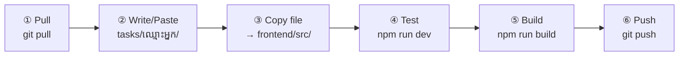
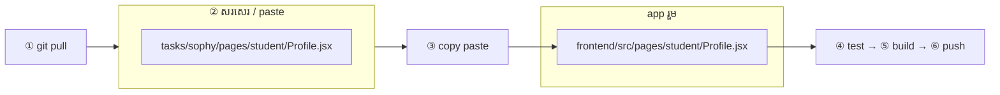

# Team tasks

**មួយ member = មួយ folder** — mirror path ក្នុង `frontend/src/`

### រូបជំហាន (គ្រប់គ្នា)

### រូប paste file — សរសេរ tasks មុន → copy ទៅ frontend

> path ដូចគ្នា — `tasks/<member>/...` = `frontend/src/...` (copy paste ធម្មតា)

**កុំ commit:** `node_modules/`, `.env`, `dist/`

---

## ជ្រើស folder របស់អ្នក

| Member | អាន step guide |
|--------|----------------|
| Bunhieng | [`bunhieng/README.md`](bunhieng/README.md) |
| Sorint | [`sorint/README.md`](sorint/README.md) |
| Sophy | [`sophy/README.md`](sophy/README.md) |
| Sokhun | [`sokhun/README.md`](sokhun/README.md) |
| Ratanak | [`ratanak/README.md`](ratanak/README.md) |
| Somnang | [`somnang/README.md`](somnang/README.md) |

---

ឯកសារពេញ: [`../frontend/docs/TEAM_TASKS.md`](../frontend/docs/TEAM_TASKS.md)
