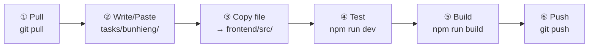
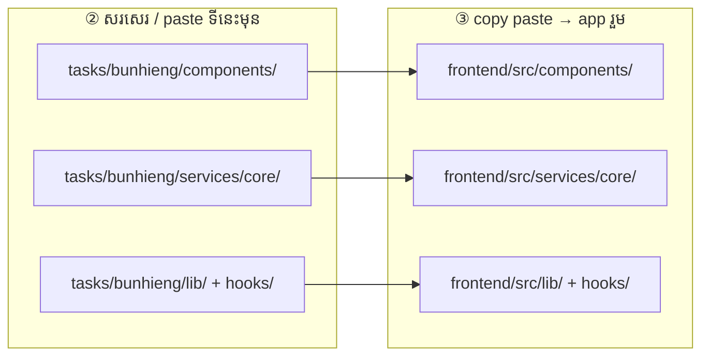

# Bunhieng — Shared core

**ធ្វើតាមលំដាប់នេះ — កុំខុសជំហាន**

Folder របស់អ្នក: **`tasks/bunhieng/`**

### រូបជំហាន (មើលមុនពេលធ្វើ)



### រូប paste file — សរសេរទីនេះមុន → copy ទៅ app



> path ដូចគ្នា — `tasks/bunhieng/components/ui/button.jsx` → `frontend/src/components/ui/button.jsx`

---

## ① Pull — យក code ថ្មី

ធ្វើ **រៀងរាល់ព្រឹក** មុនចាប់ធ្វើ

```powershell
cd "d:\Full Frontend"
git pull origin main
cd frontend
npm install
```

---

## ② កែ code — write / paste file

កែ file ក្នុង **`tasks/bunhieng/`** តែប៉ុណ្ណោះ

| Folder | ធ្វើអី |
|--------|--------|
| `components/ui/` | shadcn buttons, inputs, … |
| `components/layout/` | MainLayout, ProtectedRoute |
| `components/common/` | UI រួម (គ្រប់ role) |
| `services/core/` | `api.js`, `endpoints.js` |
| `lib/`, `hooks/` | utils, locale, hooks |

ឧទាហរណ៍: `tasks/bunhieng/services/core/endpoints.js`

> **កុំ** ដាក់ `pages/student`, `pages/mentor` ក្នុង folder នេះ

---

## ③ Copy — paste file ទៅ app រួម

**Copy file ដែលកែ** ពី `tasks/bunhieng/` → `frontend/src/` (**path ដូចគ្នា**)

```
tasks/bunhieng/services/core/endpoints.js
        ↓ copy paste
frontend/src/services/core/endpoints.js
```

- **Ctrl+C** file ក្នុង `tasks/bunhieng/...`
- **Ctrl+V** ទៅ `frontend/src/...` (folder ដូចគ្នា)
- ឬ drag & drop ក្នុង File Explorer

---

## ④ Test — រត់ app

**Terminal 1** — backend

```powershell
cd backend_rokkru
npm start
```

**Terminal 2** — frontend

```powershell
cd frontend
npm run dev
```

បើក `http://localhost:5173` → ពិនិត្យ layout, API, shared components

---

## ⑤ Build — ពិនិត្យ error

```powershell
cd frontend
npm run build
```

---

## ⑥ Push — ផ្ញើ GitLab

```powershell
cd "d:\Full Frontend"
git add tasks/bunhieng/
git status
git commit -m "feat(bunhieng): ..."
git push
```

**កុំ commit:** `node_modules/`, `.env`, `dist/`, folder member ផ្សេង

---

## Lead only — sync ទៅ team

Copy file ពី `frontend/src/` → `tasks/bunhieng/` (path ដូចគ្នា) ដើម្បី update slice របស់ team។

---

## អានបន្ថែម

**Task ត្រូវធ្វើ**

- [ ] `endpoints.js` sync ជាមួយ backend
- [ ] `apiRequest` — cookies, 401, upload
- [ ] Layout: MainLayout, ProtectedRoute

**ឯកសារពេញ:** [`../../frontend/docs/TEAM_TASKS.md`](../../frontend/docs/TEAM_TASKS.md)
