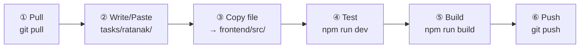
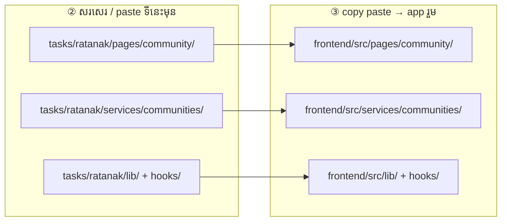

# Ratanak — Community

**ធ្វើតាមលំដាប់នេះ — កុំខុសជំហាន**

Folder របស់អ្នក: **`tasks/ratanak/`**

### រូបជំហាន (មើលមុនពេលធ្វើ)



### រូប paste file — សរសេរទីនេះមុន → copy ទៅ app



> ឧ. `tasks/ratanak/pages/community/CommunityDetail.jsx` → `frontend/src/pages/community/CommunityDetail.jsx`

---

## ① Pull — យក code ថ្មី

ធ្វើ **រៀងរាល់ព្រឹក** មុនចាប់ធ្វើ

```powershell
cd "d:\Full Frontend"
git pull origin main
cd frontend
npm install
```

---

## ② កែ code — write / paste file

កែ file ក្នុង **`tasks/ratanak/`** តែប៉ុណ្ណោះ

| Folder | ធ្វើអី |
|--------|--------|
| `pages/community/` | feed, post detail, create post |
| `pages/student/Community.jsx` | community page |
| `services/communities/` | ហៅ API |
| `lib/communityApiMap.js` | map field name |
| `hooks/` | useCommunities, useCommunityFeed |

ឧទាហរណ៍: `tasks/ratanak/pages/community/CommunityDetail.jsx`

> UI រួម (`CommunityPostCard`, …) នៅ `tasks/bunhieng/` — កុំកែដោយឯករាជ្យ

---

## ③ Copy — paste file ទៅ app រួម

**Copy file ដែលកែ** ពី `tasks/ratanak/` → `frontend/src/` (**path ដូចគ្នា**)

```
tasks/ratanak/pages/community/CommunityDetail.jsx
        ↓ copy paste
frontend/src/pages/community/CommunityDetail.jsx
```

- **Ctrl+C** → **Ctrl+V** (folder ដូចគ្នា)
- ឬ drag & drop ក្នុង File Explorer

---

## ④ Test — រត់ app

**Terminal 1** — backend

```powershell
cd backend_rokkru
npm start
```

**Terminal 2** — frontend

```powershell
cd frontend
npm run dev
```

បើក `http://localhost:5173` → login student → community feed, create post

---

## ⑤ Build — ពិនិត្យ error

```powershell
cd frontend
npm run build
```

---

## ⑥ Push — ផ្ញើ GitLab

```powershell
cd "d:\Full Frontend"
git add tasks/ratanak/
git status
git commit -m "feat(ratanak): ..."
git push
```

**កុំ commit:** `node_modules/`, `.env`, `dist/`, folder member ផ្សេង

---

## អានបន្ថែម

**API សំខាន់**

- Types → `GET /v1/students/community/types`
- Feed → `GET /v1/students/community/posts`
- Create → `POST /v1/students/community/posts`
- Detail → `GET /v1/students/community/posts/:id`

**Task ត្រូវធ្វើ**

- [ ] Feed load ពី API (មិនមែន static data)
- [ ] Create post modal posts ទៅ API
- [ ] Community picker load types ពី API

**ឯកសារពេញ:** [`../../frontend/docs/TEAM_TASKS.md`](../../frontend/docs/TEAM_TASKS.md)
