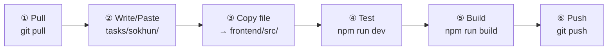
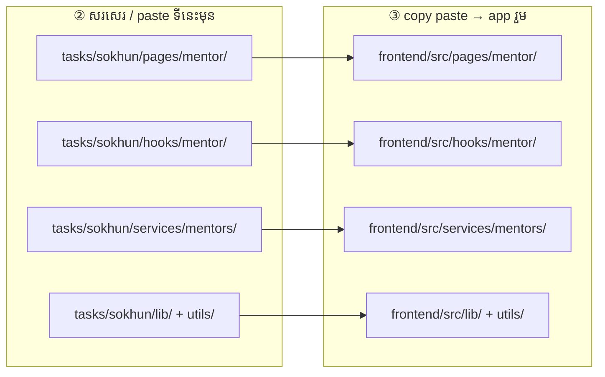

# Sokhun — Mentor

**ធ្វើតាមលំដាប់នេះ — កុំខុសជំហាន**

Folder របស់អ្នក: **`tasks/sokhun/`**

### រូបជំហាន (មើលមុនពេលធ្វើ)



### រូប paste file — សរសេរទីនេះមុន → copy ទៅ app



> ឧ. `tasks/sokhun/pages/mentor/MentorCreatePost.jsx` → `frontend/src/pages/mentor/MentorCreatePost.jsx`

---

## ① Pull — យក code ថ្មី

ធ្វើ **រៀងរាល់ព្រឹក** មុនចាប់ធ្វើ

```powershell
cd "d:\Full Frontend"
git pull origin main
cd frontend
npm install
```

---

## ② កែ code — write / paste file

កែ file ក្នុង **`tasks/sokhun/`** តែប៉ុណ្ណោះ

| Folder | ធ្វើអី |
|--------|--------|
| `pages/mentor/` | Dashboard, Profile, Create post, … |
| `hooks/mentor/` | data + page logic |
| `services/mentors/` | ហៅ API |
| `lib/mentorApiMap.js` | map field name (Khmer name) |
| `utils/`, `components/mentor/` | helper + UI |

ឧទាហរណ៍: `tasks/sokhun/pages/mentor/MentorCreatePost.jsx`

---

## ③ Copy — paste file ទៅ app រួម

**Copy file ដែលកែ** ពី `tasks/sokhun/` → `frontend/src/` (**path ដូចគ្នា**)

```
tasks/sokhun/pages/mentor/MentorCreatePost.jsx
        ↓ copy paste
frontend/src/pages/mentor/MentorCreatePost.jsx
```

- **Ctrl+C** → **Ctrl+V** (folder ដូចគ្នា)
- ឬ drag & drop ក្នុង File Explorer

---

## ④ Test — រត់ app

**Terminal 1** — backend

```powershell
cd backend_rokkru
npm start
```

**Terminal 2** — frontend

```powershell
cd frontend
npm run dev
```

បើក `http://localhost:5173` → login mentor → dashboard, profile, create post

---

## ⑤ Build — ពិនិត្យ error

```powershell
cd frontend
npm run build
```

---

## ⑥ Push — ផ្ញើ GitLab

```powershell
cd "d:\Full Frontend"
git add tasks/sokhun/
git status
git commit -m "feat(sokhun): ..."
git push
```

**កុំ commit:** `node_modules/`, `.env`, `dist/`, folder member ផ្សេង

---

## អានបន្ថែម

**API សំខាន់**

- Dashboard → `GET /v1/mentors/me/dashboard`
- Profile → `GET/PUT /v1/users/me`
- Posts → `GET/POST /v1/mentors/:id/posts`
- Stripe → `POST /v1/stripe/create-checkout-session`

**Task ត្រូវធ្វើ**

- [ ] Create post: `title`, `province_id`, `sub_skill_id`
- [ ] Khmer name mapping ក្នុង `mentorApiMap.js`
- [ ] Portfolio = link only (មិនមាន upload API)

**ឯកសារពេញ:** [`../../frontend/docs/MENTOR_FRONTEND.md`](../../frontend/docs/MENTOR_FRONTEND.md)
