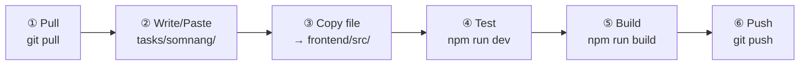
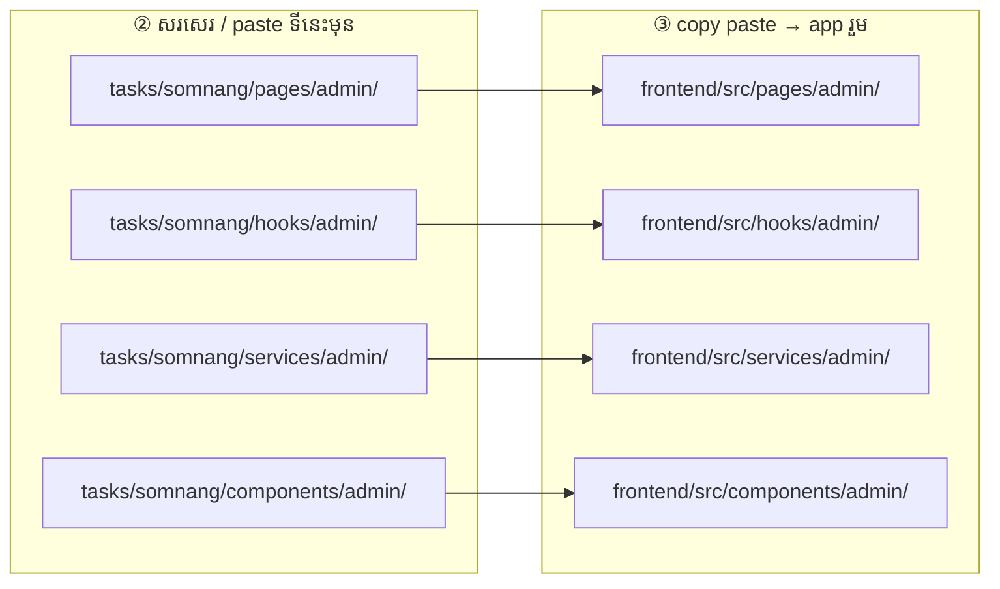

# Somnang — Admin

**ធ្វើតាមលំដាប់នេះ — កុំខុសជំហាន**

Folder របស់អ្នក: **`tasks/somnang/`**

### រូបជំហាន (មើលមុនពេលធ្វើ)



### រូប paste file — សរសេរទីនេះមុន → copy ទៅ app



> ឧ. `tasks/somnang/pages/admin/UserManagement.jsx` → `frontend/src/pages/admin/UserManagement.jsx`

---

## ① Pull — យក code ថ្មី

ធ្វើ **រៀងរាល់ព្រឹក** មុនចាប់ធ្វើ

```powershell
cd "d:\Full Frontend"
git pull origin main
cd frontend
npm install
```

---

## ② កែ code — write / paste file

កែ file ក្នុង **`tasks/somnang/`** តែប៉ុណ្ណោះ

| Folder | ធ្វើអី |
|--------|--------|
| `pages/admin/` | Dashboard, Users, Sessions, … |
| `components/admin/content/` | Help/Terms editor |
| `hooks/admin/` | data logic |
| `services/admin/` | adminApi.js, usersApi.js |

ឧទាហរណ៍: `tasks/somnang/pages/admin/UserManagement.jsx`

---

## ③ Copy — paste file ទៅ app រួម

**Copy file ដែលកែ** ពី `tasks/somnang/` → `frontend/src/` (**path ដូចគ្នា**)

```
tasks/somnang/pages/admin/UserManagement.jsx
        ↓ copy paste
frontend/src/pages/admin/UserManagement.jsx
```

- **Ctrl+C** → **Ctrl+V** (folder ដូចគ្នា)
- ឬ drag & drop ក្នុង File Explorer

---

## ④ Test — រត់ app

**Terminal 1** — backend

```powershell
cd backend_rokkru
npm start
```

**Terminal 2** — frontend

```powershell
cd frontend
npm run dev
```

បើក `http://localhost:5173` → login admin → dashboard, user table

---

## ⑤ Build — ពិនិត្យ error

```powershell
cd frontend
npm run build
```

---

## ⑥ Push — ផ្ញើ GitLab

```powershell
cd "d:\Full Frontend"
git add tasks/somnang/
git status
git commit -m "feat(somnang): ..."
git push
```

**កុំ commit:** `node_modules/`, `.env`, `dist/`, folder member ផ្សេង

---

## អានបន្ថែម

**API សំខាន់**

- Stats → `GET /v1/admin/dashboard/stats`
- Users → `GET /v1/admin/dashboard/users`
- Suspend → `PUT /v1/admin/dashboard/users/status`
- Sessions → `GET /v1/mentors/posts`

**Task ត្រូវធ្វើ**

- [ ] Dashboard cards ពី API
- [ ] User table ពី API
- [ ] Suspend / change role wired

**ឯកសារពេញ:** [`../../frontend/docs/TEAM_TASKS.md`](../../frontend/docs/TEAM_TASKS.md)
