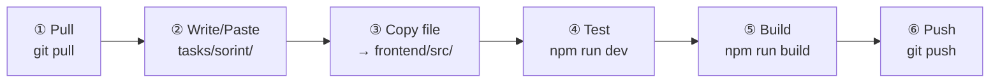
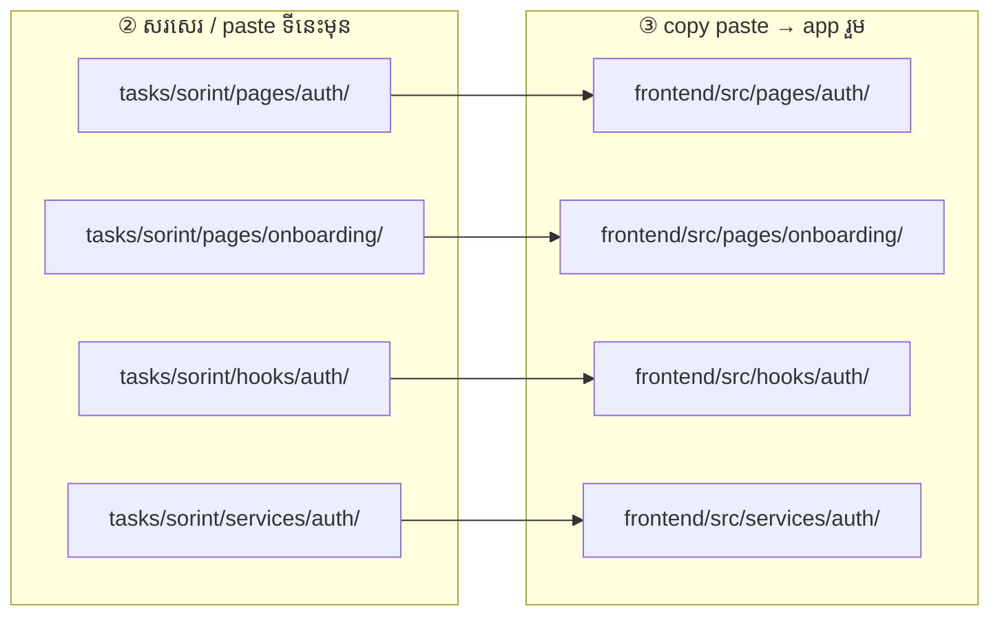

# Sorint — Auth & onboarding

**ធ្វើតាមលំដាប់នេះ — កុំខុសជំហាន**

Folder របស់អ្នក: **`tasks/sorint/`**

### រូបជំហាន (មើលមុនពេលធ្វើ)



### រូប paste file — សរសេរទីនេះមុន → copy ទៅ app



> ឧ. `tasks/sorint/pages/auth/Login.jsx` → `frontend/src/pages/auth/Login.jsx`

---

## ① Pull — យក code ថ្មី

ធ្វើ **រៀងរាល់ព្រឹក** មុនចាប់ធ្វើ

```powershell
cd "d:\Full Frontend"
git pull origin main
cd frontend
npm install
```

---

## ② កែ code — write / paste file

កែ file ក្នុង **`tasks/sorint/`** តែប៉ុណ្ណោះ

| Folder | ធ្វើអី |
|--------|--------|
| `pages/auth/` | Login, Register, Forgot password |
| `pages/onboarding/` | Choose community, Complete profile |
| `hooks/auth/` | AuthContext |
| `services/auth/` | authService.js |

ឧទាហរណ៍: `tasks/sorint/pages/auth/Login.jsx`

---

## ③ Copy — paste file ទៅ app រួម

**Copy file ដែលកែ** ពី `tasks/sorint/` → `frontend/src/` (**path ដូចគ្នា**)

```
tasks/sorint/pages/auth/Login.jsx
        ↓ copy paste
frontend/src/pages/auth/Login.jsx
```

- **Ctrl+C** → **Ctrl+V** (folder ដូចគ្នា)
- ឬ drag & drop ក្នុង File Explorer

---

## ④ Test — រត់ app

**Terminal 1** — backend

```powershell
cd backend_rokkru
npm start
```

**Terminal 2** — frontend

```powershell
cd frontend
npm run dev
```

បើក `http://localhost:5173` → login, register, OTP, onboarding

---

## ⑤ Build — ពិនិត្យ error

```powershell
cd frontend
npm run build
```

---

## ⑥ Push — ផ្ញើ GitLab

```powershell
cd "d:\Full Frontend"
git add tasks/sorint/
git status
git commit -m "feat(sorint): ..."
git push
```

**កុំ commit:** `node_modules/`, `.env`, `dist/`, folder member ផ្សេង

---

## អានបន្ថែម

**API សំខាន់**

- Login → `POST /v1/auth/login`
- OTP → `POST /v1/auth/verify-otp`
- Register → `POST /v1/auth/register`
- User types → `GET /v1/user-types`

**Task ត្រូវធ្វើ**

- [ ] Login + OTP ជាមួយ real API
- [ ] Register ប្រើ `user_type_id`
- [ ] Onboarding redirect តាម role

**ឯកសារពេញ:** [`../../frontend/docs/TEAM_TASKS.md`](../../frontend/docs/TEAM_TASKS.md)
